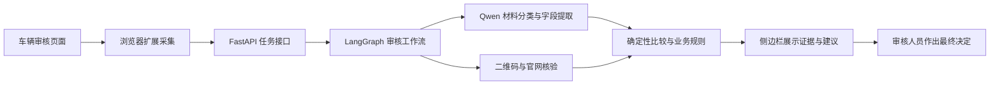

# 车辆审核辅助 Agent

一个面向车辆业务审核场景的辅助工具：浏览器扩展采集页面与材料，独立 Agent 服务完成文档识别、字段比对、二维码核验和确定性规则检查，并在侧边栏给出可追溯的审核建议。

> [!IMPORTANT]
> 本项目只提供审核辅助信息。唯一允许的页面写入是：报废置换的确定性核验全部满足后，自动填写两个原本为空的挂靠字段。本项目不会自动点击“通过”“驳回”“立即提交”或“取消”，也不替代审核人员作出最终决定。

## 核心能力

- 自动识别审核业务，也允许审核人员手动选择业务。
- 从表单、表格和只读页面结构中采集申请字段，并保留歧义诊断。
- 筛除隐藏图、装饰图和身份材料，压缩并提交最多 10 张候选业务材料。
- 使用 Qwen 进行材料分类与白名单字段提取，不让模型直接生成审核结论。
- 汇总页面、材料图片和二维码官网等多源证据，执行字段标准化与一致性比较。
- 用确定性规则生成 `PASS` 或 `REVIEW_REQUIRED`，失败和证据不足默认转人工复核。
- 通过异步任务展示识别进度、部分结果、冲突字符、证据来源和原图定位。
- 使用固定的通用 LangGraph，由 `BusinessProfile` 配置各页面需要的外部核验、业务规则和页面动作。
- 报废置换按青岛、长春分别校验政策日期；长春额外校验新车发票产地。
- 在侧边栏逐项展示所有已执行检查，异常项由审核人员在当前会话中确认后继续。

## 系统架构



更完整的模块边界和数据流见 [架构说明](docs/architecture.md)。

## 已接入业务

| 业务 | 地区 | 规则状态 | 当前行为 |
| --- | --- | --- | --- |
| 报废置换 | 青岛 | 已配置 | 9 月发票日期、10 月交车截止、主体关系、二维码及受限挂靠填写 |
| 报废置换 | 长春 | 已配置 | 7 至 9 月发票日期、12 月交车截止、长春产地、主体关系、二维码及受限挂靠填写 |
| 过户审核 | 默认 | 已配置 | 页面/图片比对、登记历史和日期顺序检查 |
| 车源审核 | 默认 | 未配置 | 明确降级为人工复核 |
| 一致性审核 | 青岛、长春 | 已隔离、规则未配置 | 使用独立地区入口，明确降级为人工复核 |

## 技术栈

| 模块 | 技术 |
| --- | --- |
| 浏览器扩展 | Manifest V3、React 19、TypeScript 6、Vite 8 |
| Agent 服务 | Python 3.11/3.12、FastAPI、Pydantic、LangGraph |
| 图像与二维码 | Pillow、OpenCV、zxing-cpp |
| 模型服务 | DashScope 兼容接口、Qwen |
| 质量检查 | pytest、Ruff、Node.js Test Runner、ESLint、GitHub Actions |

## 快速开始

### 环境要求

- Python `>=3.11,<3.13`
- [uv](https://docs.astral.sh/uv/)
- Node.js `>=22.18.0`
- npm
- Microsoft Edge 或 Google Chrome
- 可用的 DashScope API Key

### 1. 配置 Agent 服务

```powershell
cd review-agent-service
Copy-Item .env.example .env
uv sync --locked
```

编辑本地 `.env`，填入自己的密钥：

```dotenv
DASHSCOPE_API_KEY=replace-with-your-dashscope-api-key
DASHSCOPE_BASE_URL=https://dashscope.aliyuncs.com/compatible-mode/v1
DASHSCOPE_MODEL=qwen3.7-plus
```

`.env` 已被 Git 忽略，禁止提交真实密钥。

### 2. 启动 Agent

回到项目根目录：

```powershell
cd ..
.\start-agent.ps1
```

默认监听 `http://127.0.0.1:8010`。可以检查健康状态：

```powershell
Invoke-WebRequest http://127.0.0.1:8010/health
```

不启用热重载时执行：

```powershell
.\start-agent.ps1 -NoReload
```

### 3. 构建浏览器扩展

```powershell
cd review-extension
npm ci
cd ..
.\start-extension-build.ps1
```

构建完成后，在 Edge 的 `edge://extensions` 或 Chrome 的 `chrome://extensions` 中开启开发者模式，选择“加载解压缩的扩展”，加载 `review-extension/dist`。

## 验证项目

后端：

```powershell
cd review-agent-service
uv run pytest -q
uv run ruff check app tests
```

扩展：

```powershell
cd review-extension
npm test
npm run build
npm run lint
```

## 项目结构

```text
review-assistant/
├─ .github/workflows/        # GitHub Actions
├─ docs/                     # 架构与开发文档
├─ review-agent-service/     # FastAPI、LangGraph、规则与测试
├─ review-extension/         # 浏览器扩展、侧边栏与测试
├─ start-agent.ps1           # 本地启动 Agent
└─ start-extension-build.ps1 # 构建扩展
```

模块入口：

- [Agent 服务说明](review-agent-service/README.md)
- [浏览器扩展说明](review-extension/README.md)
- [开发指南](docs/development.md)
- [贡献指南](CONTRIBUTING.md)
- [安全策略](SECURITY.md)

## 当前限制

- Agent 默认是本地单进程服务，没有生产级认证、租户隔离和全局限流。
- 异步任务保存在内存中，服务重启后任务状态会丢失。
- 逐项审核进度和人工选择只保存在 Side Panel 的 React 内存中；关闭或刷新后需要重新审核。
- 图片通过 Data URL 随请求传输，尚未接入对象存储和数据保留策略。
- 扩展服务地址固定为 `127.0.0.1:8010`，Content Script 匹配范围仍需在生产发布前收紧。
- 真实业务准确率、误报率和审核收益仍需基于脱敏样本集评估。

## License

本项目采用 [MIT License](LICENSE)。
