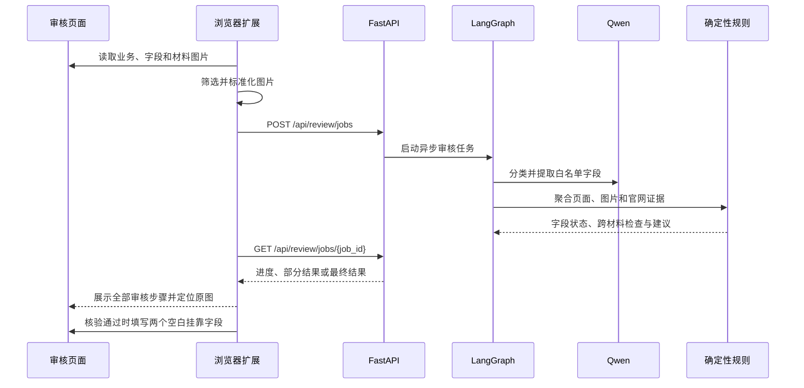

# 架构说明

## 1. 设计目标

车辆审核辅助 Agent 为审核人员提供材料识别、多源字段比对、可配置外部核验和可解释的审核建议。除报废置换中两个经过授权的空白挂靠字段外，系统不修改原业务页面。

系统遵循三个核心边界：

1. 浏览器扩展负责采集和展示，不复制后端审核规则。
2. Qwen 负责分类与字段提取，不直接决定通过或驳回。
3. 最终建议由确定性规则生成；任何失败、冲突或证据不足都安全降级为人工复核。

## 2. 端到端数据流



请求边界是 `ReviewRequest`，主要包含业务类型、地区、Profile 版本、页面字段、材料图片和采集诊断。响应边界是 `ReviewResponse`，包含字段比较、二维码检查、跨材料检查、材料完整性、重试摘要、问题列表和最终建议。

## 3. 浏览器扩展

扩展位于 `review-extension/`，由 Manifest V3 后台脚本、页面 Content Script 和 React Side Panel 组成。

### 页面采集

- `public/business-detector.js`：根据路由和页面指纹识别业务。
- `public/page-field-collector.js`：从控件、标签、表格和只读结构中提取字段。
- `public/field-matcher.js`：根据标签精度、DOM 关系和业务分区选择字段候选。
- `public/business-scope.js`：识别旧车、新车、过户和非审核资料范围。
- `public/image-candidates.js`：过滤、评分并选择材料图片。
- `public/image-normalization.js`：统一图片格式、尺寸和体积。
- `public/content.js`：协调采集脚本并处理原图定位消息。
- `public/page-field-writer.js`：只对两个挂靠字段进行联合预检、选择和回读。

图片处理约束：

| 项目 | 当前值 |
| --- | ---: |
| 单次提交上限 | 10 张 |
| 原始图片上限 | 20 MB |
| 输出图片上限 | 5 MB |
| 最大边长 | 2048 px |
| 输出格式 | JPEG |
| JPEG 质量 | 0.85 |

### Side Panel

- `src/App.tsx`：组合页面与业务选择状态。
- `src/hooks/useReviewWorkflow.ts`：页面采集、任务创建、轮询和部分结果生命周期。
- `src/reviewClient.ts`：封装异步任务 HTTP 请求和错误映射。
- `src/reviewJobs.ts`：实现 1 秒轮询与 60 秒客户端展示时限。
- `src/components/`：展示进度、材料完整性、最终建议和异常证据。
- `src/*Presentation.ts`：把后端状态转换为稳定的界面展示模型。

扩展保留每张图片的稳定 `imageId`。审核人员点击原图操作时，Content Script 只定位仍与该 ID 对应的页面元素，不会在元素失效后操作其他图片。

扩展保留采集时的标签页、页面 URL、页面实例标识、单次采集标识和由申请单号或 VIN 构成的记录指纹。页面填写只由原始标签页、URL、页面实例和强记录指纹约束；页面导航、刷新、同 URL 换单、控件已有值、控件或选项不唯一、禁用、重渲染及回读失败都会停止填写。单次采集标识 `collectionId` 仅约束原图定位，确保定位请求对应当前的图片映射。人工逐项处理状态仅存在 React 内存中，不回写后端规则结论，也不跨刷新恢复。

## 4. Agent 服务

服务位于 `review-agent-service/`，以 `app/main.py` 为 HTTP 入口。

| 层 | 目录 | 职责 |
| --- | --- | --- |
| API | `app/main.py` | 参数校验、HTTP 状态、同步与异步入口 |
| 业务配置 | `app/businesses/` | 解析业务、地区、版本和材料策略 |
| Agent | `app/agent/` | Qwen 客户端、字段路由、重试和 LangGraph 编排 |
| 领域模型 | `app/models/` | 请求、响应、证据、比较和任务状态 |
| 确定性规则 | `app/rules/` | 值标准化、字段聚合、跨材料检查和最终建议 |
| 基础服务 | `app/services/` | 审核门面、任务管理、二维码和响应组装 |

`ReviewService` 是审核门面。它先解析 `BusinessProfile`，未配置规则的业务直接返回人工复核结果；已配置业务进入 LangGraph 工作流。

## 5. LangGraph 工作流

全部已配置业务共用同一张固定主图，节点之间通过类型化 `ReviewState` 传递结果：

```text
START
  -> validate_context
  -> assess_collected_materials
  -> extract_documents
  -> assess_extracted_evidence
  -> run_external_checks
  -> compare_same_fields
  -> run_business_rules
  -> prepare_review_steps
  -> derive_recommendation
  -> build_final_response
  -> END
```

各节点的中文职责如下：

| 顺序 | 节点 | 中文说明 |
| ---: | --- | --- |
| 1 | `validate_context` | 校验业务、地区、版本和页面路由是否一致，解析唯一 Profile。 |
| 2 | `assess_collected_materials` | 按 Profile 评估采集到的材料种类、页数和分组。 |
| 3 | `extract_documents` | 调用模型分类材料，只提取当前材料白名单允许的字段和证据位置。 |
| 4 | `assess_extracted_evidence` | 检查字段缺失、不可读、不确定和同一来源内部冲突。 |
| 5 | `run_external_checks` | 按配置执行二维码等外部核验；未配置时返回空结果。 |
| 6 | `compare_same_fields` | 将页面、图片和外部来源映射到规范字段后进行一致性比较。 |
| 7 | `run_business_rules` | 按 Profile 顺序执行地区政策、主体关系或过户等确定性处理器。 |
| 8 | `prepare_review_steps` | 把本次实际执行的全部检查整理成有序、中文、可展示的步骤。 |
| 9 | `derive_recommendation` | 汇总冲突、证据不足和材料限制，生成风险与审核建议。 |
| 10 | `build_final_response` | 组装唯一最终响应及经 Profile 授权的候选页面动作。 |

页面逐项查看和挂靠填写不属于 LangGraph 节点。后端图一次运行到底，插件收到完整结果后才执行本地交互。

- 主图只表达通用审核阶段，不包含二维码、地区、挂靠或过户等业务节点。
- `BusinessProfile` 通过 `external_checks`、`rule_groups`、`page_actions` 声明需要的能力，注册表把稳定标识解析为处理器。
- 未配置能力完全跳过；外部核验设为 `WHEN_PRESENT` 时无材料也跳过，设为 `REQUIRED` 时缺少材料返回证据不足。
- 当前二维码、地区政策、主体关系和过户规则都使用普通处理器。只有未来出现多阶段、分支、重试或独立状态的复杂能力时才考虑子图适配器，主图无需改变。
- 采集前评估检查页面与材料覆盖情况。
- 文档提取对单任务最多并发处理 6 张图片。
- 单张模型调用最长 50 秒，整单工作流最长等待 55 秒。
- 部分图片失败或超时时保留已完成结果，并把未完成部分写入识别限制。
- 语义提取最多重试 1 次；二维码本地解码最多 3 轮；官网临时故障最多重试 1 次。

工作流一次运行到结束，没有等待人工、暂停、恢复、数据库或持久化 Checkpoint。

## 6. 业务 Profile

`BusinessRegistry` 使用 `(business_type, region, profile_version)` 精确解析配置。地区业务必须明确传入地区，不能借用其他地区或静默默认成青岛。

| 业务 | Profile | 材料完整性 | 二维码 | 规则 |
| --- | --- | --- | --- | --- |
| 报废置换 | `qingdao/1.0` | 观察模式 | 必需 | 青岛政策、主体关系、挂靠动作 |
| 报废置换 | `changchun/1.0` | 观察模式 | 必需 | 长春政策及产地、主体关系、挂靠动作 |
| 过户审核 | `default/1.0` | 强制模式 | 不需要 | 已配置 |
| 车源审核 | `default/1.0` | 不执行 | 不需要 | 未配置，转人工 |
| 一致性审核 | `qingdao/1.0`、`changchun/1.0` | 不执行 | 不需要 | 地区已隔离，具体规则未配置，转人工 |

## 7. 证据与确定性规则

同一字段可以包含申请页面、材料图片识别、二维码官网页面和受控辅助工具等证据来源。字段先按类型标准化，再聚合为三种状态：

| 状态 | 含义 |
| --- | --- |
| `MATCH` | 证据充分且一致 |
| `CONFLICT` | 可靠来源之间存在明确冲突 |
| `REVIEW_REQUIRED` | 字段缺失、来源不足或无法可靠判断 |

报废置换的日期和产地只使用对应票据图片的识别值。青岛新车发票日期为 `2026-09-01` 至 `2026-09-30`，交车截止日为 `2026-10-31`；长春新车发票日期为 `2026-07-01` 至 `2026-09-30`，交车截止日为 `2026-12-31`，且新车发票产地必须为长春。平台名称不检查。

主体关系按个人、公司和营业执照证据确定性判断：个人同名通过、个人不同名直接冲突；公司同名通过；不同公司需要两张分别对应公司的营业执照且法人相同；个人与公司需要公司执照法人等于该个人。证据缺失、掩码或冲突均为证据不足或冲突，不生成页面填写意图。

最终工作流只产生：

- `PASS`：必检项证据充分且规则满足；
- `REVIEW_REQUIRED`：存在冲突、缺失、识别限制、二维码异常、超时或未配置规则。

风险等级用于界面排序：全部满足为 `LOW`，证据不足为 `MEDIUM`，存在明确冲突为 `HIGH`。

## 8. 二维码安全策略

报废证明二维码经过本地解码、URL 规范化和域名白名单检查。只有允许的 HTTPS 官方域名才会被访问；重定向目标同样需要重新验证。官网返回字段作为独立证据参与比较，原始二维码 URL 不在侧边栏直接展示。

## 9. 异步任务

`ReviewJobManager` 在内存中管理任务：

1. `POST /api/review/jobs` 创建任务并返回 `202`。
2. 后台线程执行审核，并随图片完成更新快照。
3. 扩展通过 `GET /api/review/jobs/{job_id}` 轮询。
4. 任务状态为 `RUNNING`、`PARTIAL`、`COMPLETED` 或 `FAILED`。
5. 任务按最后更新时间保留 600 秒。

## 10. HTTP API

| 方法 | 路径 | 说明 |
| --- | --- | --- |
| `GET` | `/health` | 服务健康检查 |
| `POST` | `/api/review/assist` | 同步执行一次审核辅助 |
| `POST` | `/api/review/jobs` | 创建异步审核任务 |
| `GET` | `/api/review/jobs/{job_id}` | 查询进度、部分结果或最终结果 |

业务 Profile 不存在或版本不兼容时返回 `422`；任务不存在或已过期时返回 `404`。

## 11. 部署边界

当前实现适合受控本地开发和业务验证，不应直接暴露到公网。生产化至少需要认证与授权、租户隔离、HTTPS 网关、任务队列、持久化存储、对象存储、全局限流、审计日志、指标监控和数据保留策略。
