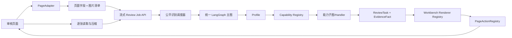

# 系统架构与边界

系统由浏览器扩展、审核服务和可注册业务能力组成。扩展采集页面事实并展示任务；服务端负责证据解释、规则判断、外部核验和最终建议。

本文中的 `Profile`（业务配置档案）描述一个业务版本，`Registry`（注册表）负责按稳定 ID 查找实现，`PageAdapter`（页面适配器）负责网页采集，`Workbench`（审核工作台）负责任务展示。完整术语请参阅[英文术语对照表](glossary.md)。

## 前后端边界

后端拥有业务规则、材料完整性、字段比较、主体关系、外部核验、置信度和建议语义。前端拥有 DOM 采集、页面身份识别、任务展示、用户交互和白名单写回。前端可以格式化后端结果，但不能重新计算资格或覆盖服务端结论；后端不能依赖浏览器 DOM 选择器。

## 数据链路

`PageData 清单 → 流式 Review Job → 单图 AgentBatchResult → ReviewState → EvidenceFact/CheckResult → ReviewTask → Workbench → PageAction`。图片正文通过逐图上传接口进入任务，不作为创建任务 JSON 的一部分。每一步都使用显式类型和可追踪的 `source`、`status`、`reason` 字段，缺失证据必须产生可解释的 `INSUFFICIENT` 或 `REVIEW_REQUIRED`。

字段任务可以同时携带 `page_field`（页面字段展示键）和 `page_target_field`（页面定位字段）。`page_field` 仅表示任务在页面字段区域的展示归属；当任务需要在助手区域展示但仍要回填真实页面控件时，必须使用 `page_target_field`，不能把助手任务伪装成 `PAGE_FIELD`。后端只输出稳定字段键和 `page_fill_intent`（页面填写意图），不输出 CSS 选择器、DOM 节点或浏览器对象；前端适配器根据字段键解析 DOM，并负责定位、高亮、回读和回滚。

## 目录原则

规则放 `app/rules`，业务配置放 `app/businesses`，执行适配放 `app/capabilities`，协议放 `app/contracts`；前端页面差异放 `src/adapters`，写回放 `src/session`，展示放 `src/components`。禁止跨层复制同一规则。

## 变更边界

增加页面使用 Adapter 和 Action Registry；增加审核业务使用 Profile、CapabilitySpec 和子图。只有状态契约、错误语义或生命周期发生变化时才修改主图，并需要补充架构审查和迁移说明。

## 关键术语

- **PageData**：浏览器从当前页面采集的原始、带来源信息的数据。它可以不完整，也可能包含 OCR 低置信度结果。
- **ReviewRequest**：发送给后端的版本化请求，包含页面身份、业务候选、材料索引、字段值、采集批次和请求 ID。
- **EvidenceFact**：后端确认过的事实，必须带字段路径、值、来源、置信度、时间和证据引用。
- **CheckResult**：一个能力或规则的机器结果，包含状态、理由、输入事实和降级信息。
- **ReviewTask**：面向审核员的可操作任务，说明需要看什么、为什么需要看、完成后影响什么。组合字段任务通过 `page_target_fields` 和 `page_values` 明确两个页面控件及其原始值，后端负责页面双值与材料值的比较，前端只执行受控的双字段写回。
- **Workbench**：前端统一任务工作台。它只根据任务类型选择 Renderer，不知道业务规则如何计算。

这些对象有不同生命周期，不能用一个“大而全”的 JSON 在层之间透传。新增字段必须说明生产者、消费者、默认值、兼容策略和脱敏要求。

## 不变量

1. 同一 `request_id` 的请求可以安全重试，重复执行不会重复写页面或生成无法去重的任务。
2. 后端建议只能由证据和规则推导，前端展示不得改变建议语义。
3. 任何自动判定都能追溯到至少一个事实、规则版本和能力版本；无法追溯时降级为人工复核。
4. 页面写回必须绑定 `page_instance_id` 和采集批次，旧页面上的任务不能写入新页面。
5. Profile、能力、协议和页面动作都可独立停用；停用结果必须可见且可解释。

## 一次请求的完整生命周期

前端打开审核页后，Adapter 先生成页面指纹并采集字段及材料索引。用户点击开始审核时，Hook 先用页面字段和图片清单创建流式任务，再用两个 Worker 逐张读取、压缩和上传图片。后端每收到一张图片就将它放入公平识别队列；全部上传关闭且识别结束后，统一 LangGraph 复用单图结果完成材料、二维码、比较、规则和建议汇总。前端轮询任务快照并按任务类型渲染；用户确认后，Action Controller 再次校验页面指纹和目标控件，执行白名单动作并回读。并发、状态和清理细节见[审核流水线、并发与任务生命周期](review-pipeline.md)。

## 反模式

- 在 API 路由中根据城市名称直接调用某个规则函数，导致业务选择绕过 Profile。
- 在前端看到字段为空时自行判断“符合条件”，造成前后端结论不一致。
- 为一个新页面复制完整组件树和主图，最终修复需要同步多份代码。
- 把 OCR 原文、DOM 节点或第三方响应直接作为公开协议字段，导致协议不可稳定演进。
- 通过异常消息向用户暴露密钥、内部 URL 或完整材料内容。

## 展示层的职责边界

展示层可以把 `MATCH` 渲染为绿色、`CONFLICT` 渲染为红色、`INSUFFICIENT` 渲染为橙色，可以把证据片段做差异高亮，也可以提供查看原图、手工选择候选值和标记人工复核的交互。这些都是对后端结果的呈现和操作入口。

展示层不能把红色改成绿色、把缺失改成通过、把一条证据选为“正确值”、把失败的回填显示为成功，或根据绿色字段数量自行推导整单通过。前端展示规范中的视觉规则必须与 `ReviewTask.result_status`、`CheckResult.status` 和 `ReviewResponse.recommendation` 一一对应。

政策日期属于后端规则结论：例如发票日期窗口和报废车交车截止日直接合并到对应字段任务的政策结果中，前端只展示理由和范围，不再创建重复的页面外日期核验。主体关系成功后，后端通过 `page_fill_intent` 给出“个人/公司”的受控填写意图，前端只执行注册动作，不根据客户名称或页面文本自行推断主体类型。
