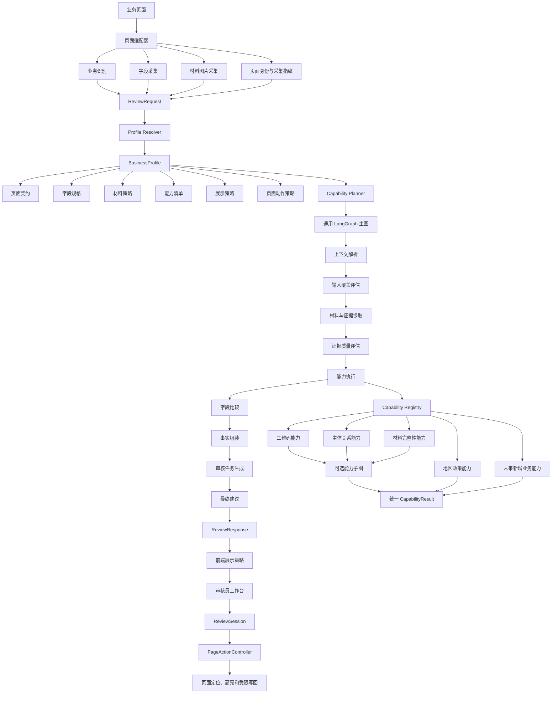

# 车辆审核辅助系统架构改造总计划

## 说明

本文档把前几轮讨论中确认的问题、目标和改造方向统一整理为最终架构方案。它描述的是完整目标状态，不是某一次迭代的局部任务清单，也不按实施优先级排序。改造过程中如果实现与本文档不一致，需要明确记录差异，不能用临时兼容逻辑代替目标设计。

## 一、改造目标

当前系统已经完成报废置换的主要审核功能，但后端规则、LangGraph 编排、前端页面适配、字段展示、状态机和页面写回之间存在职责交叉。改造完成后应达到以下状态：

```text
一张通用 LangGraph 主图
        +
BusinessProfile 业务配置
        +
能力注册表与能力执行器
        +
统一证据、核验结果和审核任务协议
        +
页面适配器
        +
前端展示状态机与页面动作控制器
```

最终要求：

1. 新增审核业务主要通过新增 Profile、字段规格、材料策略和能力配置完成，不复制整套工作流。
2. 字段是否一致、业务规则是否通过、最终建议只能由后端确定性逻辑决定。
3. 前端只负责采集、展示、人工操作、页面定位和受限写回，不重新判断业务结果。
4. 每个业务页面可以拥有自己的页面适配和展示模式，不强迫所有页面使用同一套 DOM 或界面。
5. 二维码、地区政策、主体关系、材料完整性等业务差异都可以配置和组合；复杂能力可以拥有独立子图。
6. 页面原值、材料识别值、OCR 值、规则推导值和人工输入值始终语义分离。
7. 任何页面写回都必须经过身份、控件、原值、选项和回读校验；普通回填失败不能拖死整个审核工作台。
8. 最终代码结构必须清晰、精简并符合项目代码规范：移除已失效、重复和非必要文件，避免过度拆分；保留当前业务所需的页面适配和回归保护。
9. 前端自行维护的业务源码统一使用 TypeScript/TSX；JavaScript 仅作为构建后的浏览器执行产物保留，不再长期维护同一逻辑的 JS 源文件。

## 二、最终总体架构

### 当前业务范围

本次改造只围绕两个有效业务展开：

- 青岛报废置换审核；
- 长春报废置换审核。

过户审核是历史遗留能力，改造目标中删除其 Profile、规则注册、字段配置、前端分流和相关测试/文档引用。车源和一致性当前没有有效审核规则，也不纳入本次有效业务。未来如重新支持其他业务，必须按新的业务需求单独建立 Profile 和能力，不得恢复已删除的过户旧链路。



## 三、后端职责改造

### 1. API 层

`app/main.py` 只负责：

- HTTP 路由；
- 请求反序列化和参数校验；
- 错误到 HTTP 状态的映射；
- 同步/异步任务入口。

API 层不实现字段比较、二维码判断、页面规则或前端展示逻辑。

### 2. 审核服务门面

`ReviewService` 只负责：

```text
解析 Profile
→ 创建工作流上下文
→ 启动 LangGraph
→ 转发进度
→ 返回统一响应
```

它不再直接混合模型识别、备用 OCR、字段聚合和响应拼装。当前 `_build_response` 中重复调用 OCR/vision 的路径应被拆除或明确成为独立的备用能力，不能默认与 AgentService 结果重复合并。

### 3. 统一字段规格

新增字段规格模型，例如：

```python
FieldSpec(
    key="new_vehicle.vin",
    label="新车车架号",
    normalizer="vin",
    sources=("vehicle_license", "registration_certificate", "invoice"),
    comparison_mode="PARALLEL",
    missing_policy="REVIEW_REQUIRED",
    uncertain_policy="REVIEW_REQUIRED",
    highlight_mode="CHARACTER",
    writable=False,
)
```

字段名称、中文标签、允许来源、标准化方式、比较模式、缺失处理、差异显示和页面动作关联只维护一份。现有 `review_fields.py`、`field_evidence_policies.py`、`final_advice.py`、`review_step_routing.py` 中重复的字段映射逐步迁移到字段规格目录。

### 4. 证据层

证据必须分为三层：

```text
EvidenceFact       原始来源事实
CheckResult        某项规则检查结果
ReviewTask         需要审核员处理的任务
```

`EvidenceFact` 保留原始值、规范化值、来源、图片、字段、页码、置信度和不确定标记。`CheckResult` 只表达后端检查结果。`ReviewTask` 只表达前端如何展示和处理，不能让前端根据多个数组自行拼装业务状态。

### 5. 比较引擎

字段比较唯一归属后端：

```text
允许来源过滤
→ 字段专用标准化
→ 多来源去重
→ 有效证据聚合
→ MATCH / CONFLICT / REVIEW_REQUIRED
→ 生成差异区间和冲突来源
```

前端不得改变比较状态。后端响应应直接提供：

```python
FieldComparison(
    field,
    status,
    page_value,
    settled_value,
    normalized_page_value,
    normalized_evidence_values,
    differences,
    evidence,
    message,
)
```

`differences` 应能表达增加、缺失、位置变化、连字符差异和具体字符错误。前端的 `valueDiff.ts` 降级为渲染工具，不再作为第二套业务比较算法。

### 6. 能力模型

统一使用能力声明和能力结果：

```python
CapabilitySpec(
    capability_id="scrap_certificate_qr",
    kind="EXTERNAL",
    phase="EXTERNAL_EVIDENCE",
    required=True,
    dependencies=("scrap_certificate",),
    retry_policy="profile_default",
    failure_policy="REVIEW_REQUIRED",
)
```

```python
CapabilityResult(
    capability_id,
    status,
    checks,
    evidence,
    limitations,
    page_actions,
    display_items,
)
```

当前有效业务只有青岛报废置换和长春报废置换。二维码、地区政策、主体关系、材料完整性都通过注册表提供实现，主图只负责规划和调度。过户规则属于历史遗留能力，不纳入当前 Profile、主图、能力注册表或前端分流；如未来重新支持过户，必须作为经过重新确认的新业务 Profile 独立设计，不能恢复旧实现。

## 四、LangGraph 主图改造

### 1. 目标节点

```text
resolve_context
assess_input_coverage
extract_evidence
assess_evidence_quality
plan_capabilities
execute_capabilities
compare_fields
assemble_review_facts
prepare_review_tasks
derive_recommendation
build_final_response
```

### 2. 节点职责

| 节点 | 职责 |
| --- | --- |
| `resolve_context` | 解析业务、地区、版本和唯一 Profile，生成运行上下文 |
| `assess_input_coverage` | 评估页面字段、材料、页码、采集歧义和能力前置条件 |
| `extract_evidence` | 执行材料分类和字段提取，支持专属提示词、重试和部分成功 |
| `assess_evidence_quality` | 识别缺失、不可读、不确定、重复和冲突证据 |
| `plan_capabilities` | 根据 Profile 和输入生成 READY/SKIPPED/BLOCKED/NOT_CONFIGURED 计划 |
| `execute_capabilities` | 调用注册能力或能力子图，统一超时、重试和失败结果 |
| `compare_fields` | 对所有字段执行唯一后端比较算法 |
| `assemble_review_facts` | 合并字段比较、能力结果、材料报告和识别限制 |
| `prepare_review_tasks` | 生成中文审核任务、页面字段映射、图片证据和展示路由 |
| `derive_recommendation` | 根据事实生成 PASS 或 REVIEW_REQUIRED 及风险等级 |
| `build_final_response` | 输出稳定的 ReviewResponse |

### 3. 主图分支

主图保留一张，但增加有限的通用分支：

```text
resolve_context
  ├─ Profile 不存在 → 未配置响应
  └─ Profile 存在 → 继续

assess_input_coverage
  ├─ 输入不足 → 记录限制并继续可执行部分
  └─ 输入完整 → 继续

extract_evidence
  ├─ 全部失败 → 受限审核响应
  ├─ 部分失败 → 保留成功证据并记录限制
  └─ 正常 → 继续

plan_capabilities
  ├─ 未配置 → NOT_CONFIGURED
  ├─ 前置材料缺失 → BLOCKED
  ├─ 条件不适用 → SKIPPED
  └─ 条件满足 → READY
```

字段不应被拆成大量图分支；字段差异继续通过字段规格和比较引擎处理。

### 4. 子图边界

简单规则使用普通能力处理器：

- 发票日期范围；
- 报废交车截止日期；
- 长春产地包含“长春”；
- 简单字段一致性；
- 简单材料存在性。

具备多阶段、异步等待、复杂重试或人工介入的能力使用子图：

- 二维码解码、网址安全校验、官网访问和官网字段提取；
- 主体识别、证件要求动态生成、法人关系核对和挂靠动作生成；
- 动态材料补交、缺页重采集和继续审核。

## 五、BusinessProfile 改造

Profile 继续是业务差异的声明中心，但只保存配置，不保存执行代码。

```python
BusinessProfile(
    business_type,
    region,
    version,
    page_contract,
    fields,
    material_policy,
    capabilities,
    page_actions,
    presentation,
    retry_policy,
)
```

### 1. 页面契约

描述页面需要采集哪些字段、哪些控件可编辑、字段属于哪个业务区域以及页面使用哪种适配器。

### 2. 字段集合

Profile 只选择字段规格，不重复定义字段比较算法。

### 3. 材料策略

声明材料类型、业务分组、页码、缺失策略和允许的字段来源。

### 4. 能力清单

二维码、地区政策、主体关系、材料完整性等当前有效能力以能力 ID 声明。过户检查不属于当前系统能力；未来如重新启用，必须先重新定义业务需求、页面契约、材料策略和验收用例。

### 5. 页面动作

声明哪些字段允许普通人工回填、哪些字段允许自动写入、触发条件和失败策略。

### 6. 展示策略

声明页面使用：

- 字段证据工作台；
- 传统结果页；
- 未配置规则人工复核页；
- 未来的专用业务页面。

这样前端不再通过多个文件硬编码业务类型和步骤合并方式。

## 六、前端架构改造

### 1. 页面适配层

将当前采集和写回中的大量启发式逻辑拆成页面适配器：

```text
PageAdapter
├─ BusinessDetector
├─ FieldCollector
├─ ImageCollector
├─ ControlResolver
├─ OptionResolver
└─ PageLocator
```

不同页面版本、Ant Design、Element、原生控件和微前端外壳通过适配器实现，不继续把所有分支堆在 `page-field-collector.js` 和 `page-field-writer.js` 中。

### 2. 前端数据流

```text
PageData
→ ReviewRequest
→ ReviewResponse
→ ReviewTask
→ ReviewSession
→ PageActionController
```

前端不从 `comparisons`、`cross_checks`、`issues` 和 `review_steps` 自行推断新的业务状态。

### 3. 展示层

拆分为：

```text
ReviewTaskPresenter
EvidencePresenter
DifferenceRenderer
MaterialPresenter
ExternalCheckPresenter
```

所有字段必须展示：中文名称、页面原值、材料识别值、图片、查看原图、后端状态和人工操作。差异字符根据后端差异区间渲染为红色。

### 4. 状态层

明确分离以下状态：

```text
JobStatus       后端任务状态
ReviewStatus    后端审核结论
TaskStatus      前端人工任务状态
PageStatus      页面身份状态
ActionStatus    页面写回状态
```

“已处理”只代表审核员完成了该人工任务，不能改变后端 `CONFLICT` 或 `REVIEW_REQUIRED`。

### 5. 页面动作控制器

从 `useScrapReplacementReview.ts` 中拆出：

```text
ReviewSessionController
PageIdentityGuard
ManualFillAction
AffiliationFillAction
PageActionTransaction
```

普通字段人工回填和挂靠自动填写使用不同动作类型，但共享身份校验、回读、定位和高亮能力。

## 七、页面和交互契约

以下历史问题必须作为永久验收约束：

1. 内部字段键不得直接显示给审核员，统一使用中文名称。
2. 页面原值必须来自目标真实控件，不能把“不一致”“易混淆”等提示拼进字段值。
3. OCR 文本框、页面字段和材料识别值必须分开保存和展示。
4. 材料提取值按字段逐行展示，下面横向显示缩略图和查看原图。
5. VIN、手机号、证明编号、车牌等字符串差异必须在识别值中逐字符红色标注；缺少连字符也要标红。
6. 新车车架号和 OCR 新车车架号必须是两个独立审核项，不能写死某一位字符。
7. 新车发票产地、二维码、主体关系和材料完整性必须显示对应证据和原图入口。
8. “待处理”“全部字段”“页面外核验”必须显示准确数量。
9. 人工输入框默认使用页面原值；页面值和识别值都错误时仍可输入第三个值。
10. “回填此值”只负责写入、回读、定位和高亮，不能自动变为已处理。
11. “保留页面值”没有独立业务效果时删除，人工状态只能由明确人工动作产生。
12. 页面刷新、换单、URL 变化、控件重渲染、目标不唯一或回读失败必须阻止危险写入。
13. 普通单字段回填失败不能让所有按钮永久失效；只有页面身份确实失效才阻断整轮操作。
14. 二维码安全网址通过域名校验后应可点击供人工审核；后台暂时访问失败不能等同于网址非法。

## 八、数据契约和错误语义

### 1. 状态统一

后端字段状态保留：

```text
MATCH
CONFLICT
REVIEW_REQUIRED
```

能力执行状态增加：

```text
READY
SKIPPED
BLOCKED
NOT_CONFIGURED
SUCCEEDED
FAILED
```

前端任务状态不得覆盖后端事实状态。

### 2. 错误分类

所有失败应区分：

- 输入缺失；
- 页面字段歧义；
- 材料缺失；
- OCR 失败；
- 外部服务失败；
- 安全校验失败；
- 规则冲突；
- 页面身份失效；
- 控件写回失败；
- 回读失败。

不同错误在后端建议、前端展示和是否允许继续执行方面应有明确语义，不能都转换成一条“识别异常”。

## 九、删除和收敛的内容

改造完成后应收敛以下重复来源：

- 后端默认重复 OCR/vision 路径；
- 前端自行计算审核状态的逻辑；
- 前后端重复的字段中文名称和业务 Profile 判断；
- `ReviewResponse`、`ReviewCheck`、`ReviewStep` 中互相重复的异常表达；
- `useScrapReplacementReview.ts` 中混合的状态机、页面通信和业务写回；
- `page-field-writer.js` 中混合的 DOM 框架适配和挂靠业务规则；
- 过户业务的历史 Profile、规则处理器、字段和前端分流（当前不支持）；
- 旧版页面标记相关的过时协议和无效文件引用；
- 只为兼容历史实现而存在、但会覆盖新状态语义的前端分支。

历史方案保留在 `docs/archive/`，不再作为当前架构来源。

## 十、改造完成后的目录形态

```text
review-agent-service/app/
├─ api/
├─ agent/
│  ├─ workflow.py
│  ├─ planner.py
│  ├─ capabilities/
│  └─ subgraphs/
├─ businesses/
│  ├─ profiles.py
│  ├─ page_contracts.py
│  ├─ material_policies.py
│  └─ replacement_policies.py
├─ fields/
│  ├─ specs.py
│  ├─ normalizers.py
│  ├─ comparators.py
│  └─ evidence.py
├─ rules/
│  ├─ capability_registry.py
│  ├─ field_comparison.py
│  ├─ material_completeness.py
│  └─ ...
├─ models/
│  ├─ evidence.py
│  ├─ checks.py
│  ├─ tasks.py
│  └─ review.py
└─ services/

review-extension/
├─ public/
│  ├─ adapters/
│  ├─ collectors/
│  ├─ actions/
│  ├─ identity/
│  └─ content.js
└─ src/
   ├─ api/
   ├─ session/
   ├─ presenters/
   ├─ components/
   └─ types/
```

上述目录是职责示意，不是必须逐个创建的文件清单。最终按实际代码规模组织目录，同一能力只保留一个明确的实现归属；没有实际实现的目录不预先创建，简单逻辑不为对应一个架构名称而单独建文件。拆分是否合理以职责是否清楚、依赖是否单向、是否便于测试为依据。

### 代码组织和文件清理要求

- 每个业务能力有明确入口，新接手的人可以从入口追踪配置、执行、结果展示和页面动作，不必在多个同名 helper 中寻找实现。
- 按职责拆开复杂模块，同时合并没有独立职责、仅作无意义转发的小文件；不以文件数量或行数作为唯一判断标准。
- 删除已替代的流程、无人调用的组件与 Hook、重复工具、无效资源、临时调试文件和无效依赖；清理对应测试、导出、配置和文档引用。
- 删除前检查运行入口、导入、动态加载、Manifest 脚本顺序、公共全局对象、构建和打包配置。不能因为静态搜索不到 import 就判定扩展脚本无用，也不能删除打包所需的文件。
- Mock、测试替身和合成样例归入测试支持目录；生产代码通过明确接口注入依赖，不默认使用测试工具作为审核能力。
- 迁移期间如需兼容旧协议或页面版本，记录支持范围和移除条件。新链路替代后删除过渡代码；仍在使用的个性化页面适配不能当成冗余兼容代码删除。
- 不提交生成产物、缓存、虚拟环境、安装依赖或真实业务调试数据；保留构建、测试和包管理必需的配置及锁文件。
- 文件移动必须同步维护导入路径、Manifest、构建配置、测试和文档；交付时说明删除或合并了什么、原职责由哪里承接。

### 前端语言与构建约束

前端采用“TypeScript 源码 → 构建 → 浏览器执行 JavaScript”的模式：

```text
src/**/*.ts / src/**/*.tsx
        ↓
类型检查、测试、Vite 构建
        ↓
dist/**/*.js
        ↓
Chrome / Edge 加载扩展
```

- React 组件使用 `.tsx`；页面采集、页面适配、Content Script、后台脚本、消息协议、原图定位、回填和状态管理使用 `.ts`。
- `public/manifest.json` 最终指向构建生成的 JavaScript；Chrome/Edge 不能直接加载 TypeScript。`dist/` 是生成目录，不手工修改，也不把其中的 JS 当作源码维护。
- 现有 `public/*.js` 业务脚本迁移为 TypeScript 模块。迁移时同时处理 Manifest 入口、Vite 多入口配置、脚本加载顺序、测试导入路径和公共导出；不能只修改文件后缀。
- 采集、回填、原图定位和后台通信使用共享的 TypeScript 消息类型。浏览器消息、DOM 数据和后端 JSON 仍需运行时校验，TypeScript 类型不能替代运行时校验。
- 迁移过程中逐步消除通过 `globalThis` 和脚本顺序传递业务依赖的方式，优先改为模块导入；只有浏览器入口必须暴露的全局对象才保留明确的适配层。
- 启用严格 TypeScript 检查，禁止用 `any`、无依据的类型断言或关闭检查掩盖前后端协议问题。第三方库缺少类型时增加局部适配声明，并限制在边界层使用。
- 构建产物中的 JavaScript 可以存在多个入口文件，但每个入口必须能追溯到唯一的 TypeScript 源文件和构建配置。

### 代码规范要求

- Python 使用一致的命名、导入排序、格式化和明确的类型契约；前端遵守 TypeScript、React Hooks 和 ESLint 规则。格式化、静态检查、类型检查在本地与 CI 使用同一套命令。
- 组件、Hook 和纯函数分别承担展示、生命周期和计算职责；避免把状态转换、网络请求、业务判断和长段 JSX 挤在单个函数或一行代码中。
- 公共接口使用明确类型；对外部 JSON、浏览器消息和 DOM 结果先做运行时校验，再进入内部模型，避免用 `Any`、`any` 或无校验的类型断言掩盖协议不一致。
- 字段、能力、页面动作和错误码使用集中定义的稳定标识，避免散落的魔法字符串和根据中文提示推断业务状态。
- 异步操作有明确的结束、失败、超时和资源释放路径；异常不能静默吞掉，也不能通过关闭检查来绕过问题。
- 注释解释业务原因、页面兼容条件和非直观约束；删除过时注释、注释掉的旧实现及重复描述代码的注释。
- 测试验证对外行为和跨层契约；随重构更新测试结构，保留历史页面问题的回归场景，不为了迁就源码文本匹配测试而保留失效实现。

## 十一、改造验收标准

### 结构与代码质量

- 当前正式链路只有一个清晰入口，不存在承担同一业务职责的新旧实现长期并行。
- 每个保留模块都有明确职责和实际用途，没有空架构目录、无效转发层、失效导出或无用依赖。
- 历史页面个性化行为有对应适配器和回归用例，精简文件后仍满足第七章的交互契约。
- 删除或合并文件后，源码引用、动态加载、Manifest、打包和文档链接均有效。
- 格式化检查、Ruff、ESLint、TypeScript 类型检查、构建及相关回归测试通过；CI 不通过跳过检查或大范围忽略错误获得成功。
- 前端正式业务逻辑不再存在重复维护的 JS/TS 两套源码；Manifest、构建产物和测试均从 TypeScript 源码生成或引用。
- TypeScript 严格检查通过，消息协议、后端响应和 DOM 边界均有明确类型及运行时校验。
- 交付同时包含最终目录说明、模块职责和清理记录，主手册同步更新，避免再次形成多套互相冲突的说明。

### 后端

- 同一材料不会被默认识别两次并混入比较结果。
- 新增业务不需要复制 LangGraph 主图。
- 新增简单规则只需增加 Profile 配置和能力处理器。
- 二维码、主体关系等复杂能力可以独立测试和替换。
- 字段比较、标准化和最终建议不存在前端实现副本。
- 所有能力都能输出统一状态、证据、限制和页面动作。

### 前端

- 页面适配器能够隔离不同页面版本和控件框架。
- 前端只渲染后端状态，不自行改变审核结论。
- 差异展示与后端比较基础一致，单字符错误可稳定标红。
- 图片和原图定位始终通过稳定身份关联。
- 人工回填、挂靠自动填写、定位、高亮和回滚彼此解耦。
- 页面失效、控件失败和普通回填失败有不同处理结果。

### 业务扩展

- 新增一个页面版本不需要修改所有通用采集器条件分支。
- 新增字段有统一字段规格、来源策略、比较策略和展示策略。
- 新增业务能够声明自己的材料、能力、动作和展示模式。
- 未配置业务不会误报通过，也不会执行页面写入。

### 真实页面

- 重新加载扩展并刷新页面后，字段采集、材料关联、差异标红、二维码链接、图片定位、普通回填和挂靠下拉选择均可验证。
- 页面原值变化、同 URL 换单、隐藏表单重复、控件重渲染和选项歧义均能安全阻断。
- 回填成功后审核员能看到真实页面字段已更新并获得高亮定位。

## 十二、最终判断

系统最终不应演变成“每个业务一张图”，也不应演变成“所有逻辑都塞进 Profile”或“所有展示规则都写在 React 组件里”。正确结构是：

```text
Profile 声明业务需要什么
能力注册表决定能力如何执行
通用主图决定审核阶段如何编排
后端比较引擎决定字段是否一致
统一协议传递事实和审核任务
页面适配器解决具体页面差异
前端状态机负责人工操作
页面动作控制器负责安全写回
```

这样既能保留当前两种报废置换业务的复杂页面经验，也能让未来重新规划的其他审核业务在不复制主流程的情况下独立演进。当前车源、一致性和过户都不属于有效业务能力，不能因代码中残留历史文件就对外宣称已经支持。
